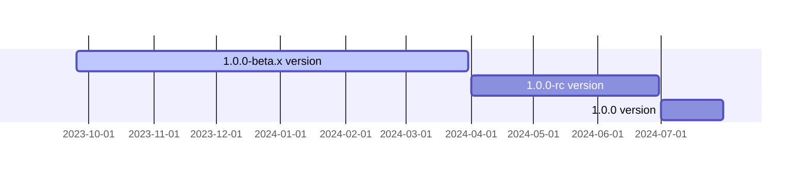

<p align="center">
  <a href="https://opentiny.design/tiny-engine" target="_blank" rel="noopener noreferrer">
    
  </a>
</p>

<p align="center">TinyEngine enables developers to customize low-code platforms, build low-bit platforms online in real time, and support secondary development or integration of low-bit platform capabilities.</p>

English | [简体中文](README.zh-CN.md)

🌈 Features:

- Cross-end cross-frame front-end components
- Supports online real-time construction, secondary development, or being integrated.
- Directly generate deployable source code without engine support.
- Allows access to third-party components and customized extension plug-ins.
- Supports high-code and low-code, and hybrid development and deployment of applications.
- The platform accesses AI big model capabilities to help developers build applications.

## Documentation

- intro：https://opentiny.design/tiny-engine#/home
- tutorial：https://opentiny.design/tiny-engine#/help-center/course/engine
- playground：https://opentiny.design/tiny-engine#/tiny-engine-editor

## Development

### Dependencies required for installation

```sh
$ pnpm install
```

### Local development: Start the local mock server and use the mock data of the local mock server.

```sh
$ pnpm dev
```

## Local development, directly connected to the local tiny-engine-webservice server

1. Start <a href="https://github.com/opentiny/tiny-engine-data-center/blob/main/README.md" target="_blank">tiny-engine-data-center</a>

2. Start <a href="https://github.com/opentiny/tiny-engine-webservice/blob/main/README.md" target="_blank">tiny-engine-webservice</a>

3. Modify the origin value in `vite.config.js` in the `packages/design-core/` directory of the tiny-engine project to be the address port of your local webService project (the webService port defaults to 7011), such as:


### Materials Synchronization [Solution](https://opentiny.design/tiny-engine#/help-center/course/engine/56)

```sh
$ pnpm splitMaterials
```

```sh
$ pnpm buildMaterials
```

Open a browser: `http://localhost:8080/?type=app&id=918&tenant=1&pageid=NTJ4MjvqoVj8OVsc`
`url search` Parameters:

- `type=app` Application type
- `id=xxx` Application ID
- `tenant=xxx` Organization ID
- `pageid=xxx` Page ID

## Build

```sh
# Build all plug-ins first
pnpm build:plugin

# Build Designer
pnpm build:alpha or build:prod

```

## Milestones



## 🤝 Participation and Contribution

If you are interested in our open source project, please join us! 🎉

Please read the [Contribution Guide](CONTRIBUTING.md) before participating in the contribution.

- Add official assistant WeChat opentiny-official and join the technical exchange group
- Join the mailing list opentiny@googlegroups.com

## License

[MIT](LICENSE)
