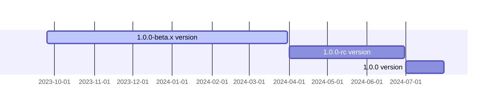

<p align="center">
  <a href="https://opentiny.design/tiny-engine" target="_blank" rel="noopener noreferrer">
    
  </a>
</p>

<p align="center">TinyEngine低代码引擎使能开发者定制低代码平台，支持在线实时构建低码平台，支持二次开发或集成低码平台能力</p>

[English](README.md) | 简体中文

🌈 特性：

- 跨端跨框架前端组件
- 支持在线实时构建、支持二次开发或被集成
- 直接生成可部署的源码，运行时无需引擎支撑
- 允许接入第三方组件、允许定制扩展插件
- 支持高代码与低代码，混合开发部署应用
- 平台接入 AI 大模型能力，辅助开发者构建应用

## 文档

- 介绍：https://opentiny.design/tiny-engine#/home
- 使用文档：https://opentiny.design/tiny-engine#/help-center/course/engine
- 演示应用：https://opentiny.design/tiny-engine#/tiny-engine-editor

## 开发

### 安装所需的依赖

```sh
$ pnpm install
```

### 本地开发，启动本地 mock 服务器，使用本地 mock 服务器的 mock 数据

```sh
$ pnpm dev
```

浏览器打开：`http://localhost:8080/?type=app&id=918&tenant=1&pageid=NTJ4MjvqoVj8OVsc`  
`url search`参数：

- `type=app` 应用类型
- `id=xxx` 应用 ID
- `tenant=xxx` 组织 ID
- `pageid=xxx` 页面 ID

## 构建

```sh
# 先构建所有插件
pnpm run build:plugin

# 构建设计器
pnpm run build:alpha  或 build:prod

```

## 里程碑



## 🤝 参与贡献

如果你对我们的开源项目感兴趣，欢迎加入我们！🎉

参与贡献之前请先阅读[贡献指南](CONTRIBUTING.zh-CN.md)。

- 添加官方小助手微信 opentiny-official，加入技术交流群
- 加入邮件列表 opentiny@googlegroups.com

## 开源协议

[MIT](LICENSE)
