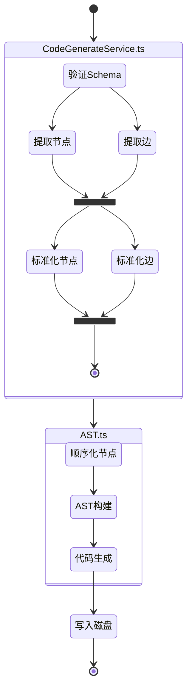

# code generate

## 流程图

```mermaid
stateDiagram
  state join1 <<join>>
  state join2 <<join>>
  [*] --> CodeGenerateService.ts
  CodeGenerateService.ts --> AST.ts
  state CodeGenerateService.ts {
    验证Schema --> 提取节点
    验证Schema --> 提取边
    提取节点 --> join1
    提取边 --> join1
    join1 --> 标准化节点
    join1 --> 标准化边
    标准化节点 --> join2
    标准化边 --> join2
    join2 --> [*]
  }
  state AST.ts {
    顺序化节点 --> AST构建
    AST构建 --> 代码生成
  }
  代码生成 --> 写入磁盘
  写入磁盘 --> [*]
```

## 附件

[函数组合的可交换性讨论](../../proof/函数组合的可交换性讨论.pdf)