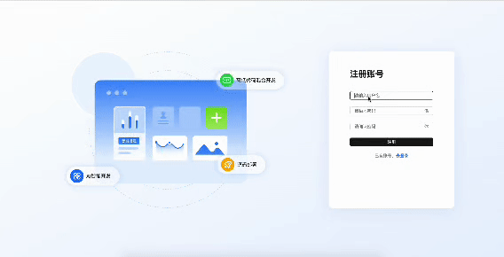
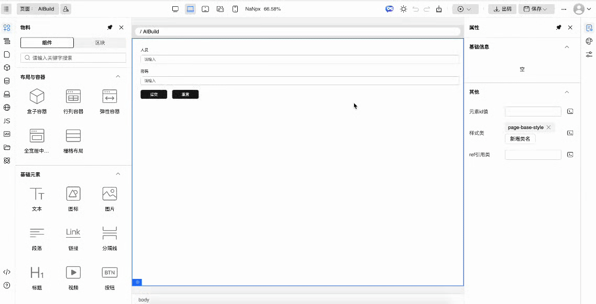
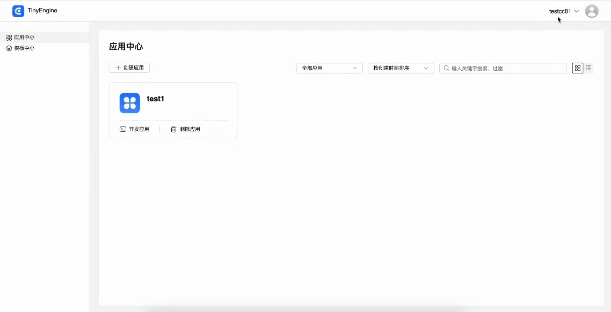

# TinyEngine 登录功能介绍

## 概述

本文档介绍 TinyEngine 低代码平台新增的用户登录认证与权限控制系统。该系统提供了完整的用户注册、登录、密码找回功能，并实现了基于 Token 的 API 请求认证机制。

## 一、界面操作

1. 登录界面：包含登录、注册、忘记密码、注册成功</br>
   
2. 用户配置插件</br>
   
3. 应用中心和模板中心的用户组织切换</br>
   

## 二、核心模块功能

1. HTTP 拦截器模块

- 位置：packages/common/composable/http/index.ts
- 作用：拦截所有 API 请求，进行认证检查和 Token 管理
- 关键特性：</br>
  1.  请求前检查登录状态</br>
  2.  自动为认证请求添加 Authorization 头部</br>
  3.  统一处理认证错误</br>
  4.  支持请求取消机制</br>
  5.  环境适配（开发/生产环境行为不同）

2. 全局状态管理模块

- 位置：packages/common/composable/defaultGlobalService.ts
- 作用：管理用户登录状态、用户信息和租户上下文
- 关键 API：</br>
  1.  getLoginStatus()：获取当前登录状态</br>
  2.  setNeedToLogin()：设置登录需求状态</br>
  3.  getUserInfo()/setUserInfo()：用户信息管理</br>
  4.  fetchUserInfo()：从 API 获取用户信息</br>
  5.  setTenantInfo()：设置租户上下文

3. 登录组件模块

- 位置：packages/design-core/src/login/
- 组件结构：</br>
  1.  Index.vue：登录页面容器</br>
  2.  Login.vue：登录表单</br>
  3.  Register.vue：注册表单</br>
  4.  ForgotPassword.vue：密码找回</br>
  5.  RegisterSuccess.vue：注册成功提示</br>
  6.  useLogin.ts：共享状态和逻辑

4. 用户工具栏模块

- 位置：packages/toolbars/user/
- 功能：显示用户信息、组织管理和退出登录
- 特性：</br>
  1.  显示当前用户和头像</br>
  2.  组织列表和切换功能</br>
  3.  创建新组织</br>
  4.  退出登录操作</br>

## 三、关键技术特性

1. 请求取消机制：</br>
   使用 AbortController 实现请求取消，确保未登录状态下不会发出不必要的 API 请求。当检测到用户未登录时，自动取消所有非白名单请求.</br>
   白名单接口（无需认证）：
   ```js
   // 登录相关接口
   '/platform-center/api/user/login'
   '/platform-center/api/user/register'
   '/platform-center/api/user/forgot-password'
   '/platform-center/api/user/me'
   '/platform-center/api/user/tenant'
   // AI 相关接口
   'app-center/api/chat/completions'
   'app-center/api/ai/chat'
   'app-center/api/ai/search'
   ```
2. 密码验证策略：</br>
   密码必须同时满足以下所有条件：

- 密码长度：8-20 个字符
- 必须包含大写字母（A-Z）
- 必须包含小写字母（a-z）
- 必须包含数字（0-9）
- 必须包含特殊字符：!@#$%^&\*()\_+-=[]{};":\|,.'<>?。
- 不能有 3 个及以上连续相同字符

3. 环境配置系统:</br>

- 开发环境（MODE=dev）：
  1. 启动项目是通过 **pnpm dev:withAuth** 命令开启登录，**pnpm dev** 命令默认不开启
  2. 在 packages/design-core/registry.js 配置
     ```js
     const isDevelopEnv = import.meta.env.MODE?.includes('dev')
     const useAuth = import.meta.env.VITE_AUTH === 'true'
     // 通过设置enableLogin为true启动登录
     enableLogin: useAuth || !isDevelopEnv
     ```
- 生产环境：启用完成登录认证

4. 多租户支持：</br>

- 用户可属于多个组织
- 动态切换组织上下文
- 组织间数据隔离
- URL 参数标识当前应用，当 URL 没有应用 id，会跳转到应用中心
