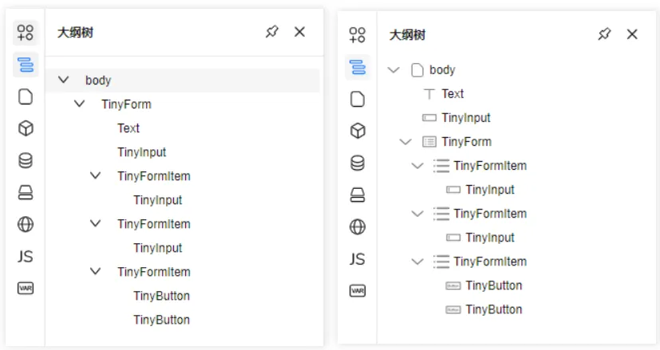
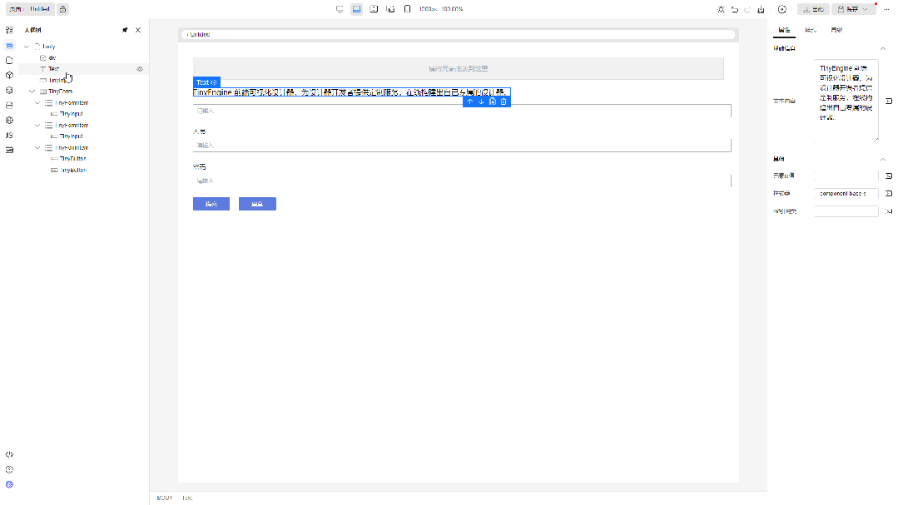
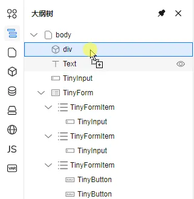
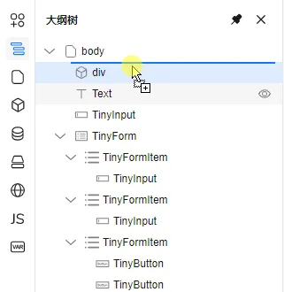
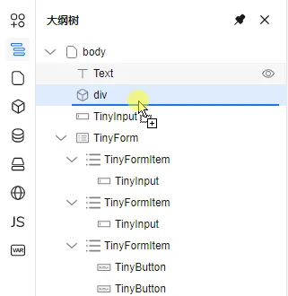
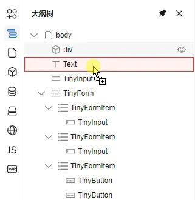
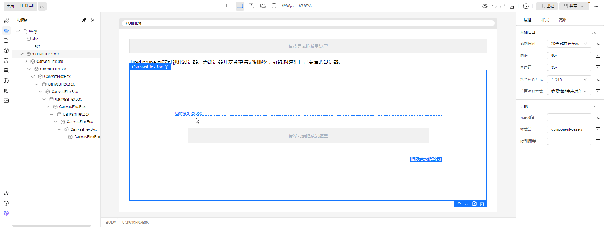
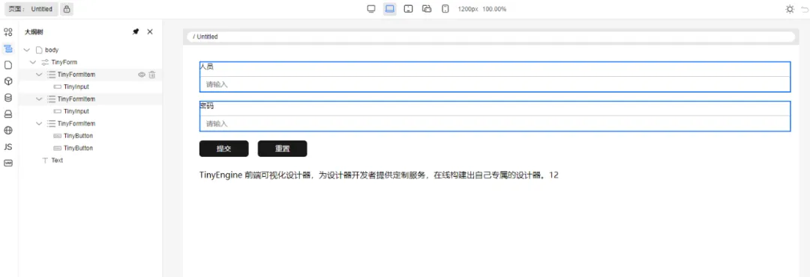

# 查看大纲树

在左侧插件栏中，单击，展开并查看页面大纲树。

##  大纲树UI展示
   

## 节点支持拖拽

大纲树节点支持拖拽，下面是一个最基础的拖拽文本到div容器的例子

   

拖拽时鼠标悬停节点即拖拽目标节点。拖拽交互分为三类：拖拽为目标节点的子节点、拖拽为目标节点的前一个兄弟节点、拖拽为目标节点的后一个兄弟节点。UI分别为如下表示：

将Text节点拖拽为div节点的子节点。拖拽为目标节点的子节点时，目标节点显示全部边框

   

将Text节点拖拽为div节点的前一个兄弟节点。拖拽为目标节点的前一个兄弟节点时，目标节点显示上边框

   

将Text节点拖拽为div节点的后一个兄弟节点。拖拽为目标节点的后一个兄弟节点时，目标节点显示下边框

   

另外如果禁止拖拽，则目标节点的背景色会高亮警告。如下图所示，将div节点拖拽为Text节点的子节点是行不通的

   

禁止拖拽的逻辑和画布是保持一致的，由物料组件的 isContainer 和 nestingRule 属性决定。目标节点对应的组件的属性 isContainer 为 True 是允许其他节点拖拽为目标节点的子节点的前提条件，nestingRule 请参考物料资产包协议中的组件属性信息结构规范章节

## 大纲树嵌套深度很深时，显示横向滚动条

   

## 大纲树支持复制、删除、多选能力

长按 ctrl + 鼠标单击，可支持元素多选，多选节点后可以结合快捷键可以实现批量复制、粘贴、删除操作，多选选中的节点在大纲树和画布会同步显示。如下图所示

   

另外还给大纲树补充了几个其他常用的快捷键，具体看如下表格

<table>
  <thead class="ant-table-thead">
    <tr>
      <th key=name>大纲树支持的快捷键</th><th key=type>功能说明</th><th key=required>支持多选</th>
    </tr>
  </thead>
  <tbody className="ant-table-tbody">
      <tr key=0-0><td key=0> ctrl+鼠标点击</td><td key=1>选择多个节点。如点击已选中节点后，则为取消选中</td><td key=2>否</td></tr>
      <tr key=0-0><td key=0> ctrl+c</td><td key=1>复制节点</td><td key=2>是</td></tr>
      <tr key=0-0><td key=0> ctrl+v</td><td key=1>粘贴节点</td><td key=2>是</td></tr>
      <tr key=0-0><td key=0> ctrl+x</td><td key=1>剪切节点</td><td key=2>是</td></tr>
      <tr key=0-0><td key=0> delete</td><td key=1>删除节点</td><td key=2>是</td></tr>
      <tr key=0-0><td key=0> ctrl+z</td><td key=1>撤销历史记录</td><td key=2>否</td></tr>
      <tr key=0-0><td key=0> ctrl+y</td><td key=1>回退历史记录</td><td key=2>否</td></tr>
      <tr key=0-0><td key=0> ctrl+s</td><td key=1>保存页面schema</td><td key=2>否</td></tr>
   </tbody>
</table>

