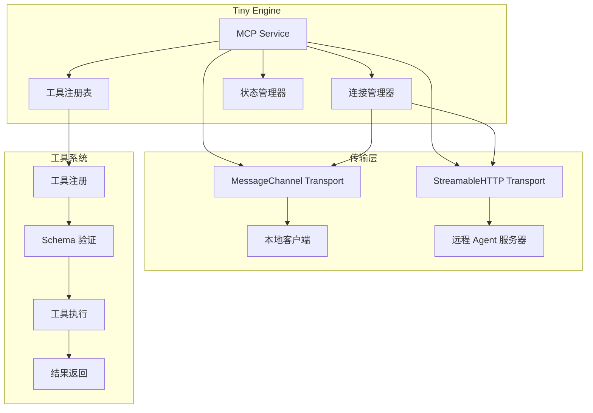

# MCP 服务扩展能力

## 概述

MCP (Model Context Protocol) 服务是 tiny-engine 的核心扩展能力之一，它基于 [Model Context Protocol](https://modelcontextprotocol.io/introduction) 标准协议，提供了工具（Tools）的管理和执行能力。

关于 MCP 协议的详细介绍，请参考官方文档：[https://modelcontextprotocol.io/introduction](https://modelcontextprotocol.io/introduction)

### 主要特性

- 🔧 **工具管理系统**：支持工具的动态注册、启用、禁用和移除
- 🌐 **双模式连接**：支持本地模式和远程 Agent 服务器连接模式
- 🔄 **自动重连机制**：提供可配置的重连策略和连接状态监控
- 📡 **量子纠缠传输**：使用创新的传输对技术实现高效通信
- 🛡️ **类型安全**：完整的 TypeScript 支持和 Zod schema 验证
- 📊 **状态管理**：完善的状态管理和事件发布机制

## 核心组件

### 1. 传输层 (Transport Layer)
负责客户端和服务器之间的通信，支持两种模式：
- **MessageChannel 传输**：用于本地量子纠缠通信
- **StreamableHTTP 传输**：用于远程服务器连接

### 2. 工具系统 (Tool System)
提供完整的工具生命周期管理：
- 工具注册和发现
- 输入/输出 schema 验证
- 工具执行和回调
- 动态启用/禁用

### 3. 连接管理 (Connection Management)
处理服务器连接和状态管理：
- 连接状态监控
- 自动重连机制
- 会话持久化

## 快速开始

### 基本使用

```typescript
import { getMetaApi } from '@opentiny/tiny-engine-meta-register'
import type { ToolItem } from '@opentiny/tiny-engine-common'

// 获取 MCP 服务实例
const mcpService = getMetaApi('engine.service.mcp')

// 注册一个简单的工具
const helloTool: ToolItem = {
  name: 'hello_world',
  title: 'Hello World 工具',
  description: '一个简单的问候工具',
  callback: async (params) => {
    return { content: `Hello, ${params.name || 'World'}!` }
  }
}

// 注册工具
mcpService.registerTool(helloTool)

// 获取工具列表
const toolList = mcpService.getToolList()
console.log('已注册的工具:', toolList)
```

### 高级配置

```typescript
// 配置 MCP 服务选项
const mcpOptions = {
  proxyUrl: 'https://your-agent-server.com/mcp',
  connectToAgentServer: true,
  reconnectAttempts: 5,
  reconnectInterval: 2000
}

// 通过 setOptions 设置自定义配置
const mcpService = getMetaApi('engine.service.mcp')
mcpService.setOptions(mcpOptions)
```

## 架构设计



## API 参考

### 服务配置接口

```typescript
interface IOptions {
  // 代理服务器 URL，用于连接远程 Agent 服务器
  proxyUrl: string | null
  
  // 是否连接到 Agent 服务器
  connectToAgentServer: boolean
  
  // 重连尝试次数（默认：3）
  reconnectAttempts?: number
  
  // 重连间隔时间，毫秒（默认：1000）
  reconnectInterval?: number
}
```

### 工具定义接口

```typescript
interface ToolItem {
  // 工具唯一标识符
  name: string
  
  // 工具显示名称
  title?: string
  
  // 工具描述
  description?: string
  
  // 输入参数 schema（Zod）
  inputSchema?: ZodRawShape
  
  // 输出结果 schema（Zod）
  outputSchema?: ZodRawShape
  
  // 工具注解信息
  annotations?: ToolAnnotations
  
  // 工具执行回调函数
  callback: ToolCallback<ZodRawShape | undefined>
}
```

### 连接状态类型

```typescript
type ServerConnectionStatus = 
  | 'connected'      // 已连接
  | 'disconnected'   // 已断开
  | 'connecting'     // 连接中
  | 'disconnecting'  // 断开中
  | 'error'          // 连接错误
```

### 主要 API 方法

#### 服务器管理

```typescript
// 获取 MCP 服务器实例
getMcpServer(): McpServer | null

// 获取 MCP 客户端实例
getMcpClient(): Client | null

// 获取远程传输实例
getRemoteTransport(): any

// 获取服务器连接状态
getServerConnectionStatus(): ServerConnectionStatus
```

#### 连接管理

```typescript
// 连接到远程服务器
connectToRemoteServer(): Promise<void>

// 重新连接到远程服务器
reconnectToRemoteServer(): Promise<void>

// 关闭远程服务器连接
closeRemoteServer(): Promise<void>

// 关闭传输连接
closeTransport(): Promise<void>
```

#### 工具管理

```typescript
// 注册工具
registerTool(tool: ToolItem): void

// 获取所有工具列表
getToolList(): ToolItem[]

// 根据名称获取工具
getToolByName(name: string): ToolItem | undefined

// 获取工具实例
getToolInstance(name: string): RegisteredTool | undefined

// 启用工具
enableTool(name: string): void

// 禁用工具
disableTool(name: string): void

// 移除工具
removeTool(name: string): void

// 更新工具配置
updateTool(name: string, config?: UpdateToolConfig): void
```

## 工具管理详解

### 工具注册

工具注册是 MCP 服务的核心功能。每个工具都需要定义清晰的接口和回调函数：

```typescript
import { z } from 'zod'
import { getMetaApi } from '@opentiny/tiny-engine-meta-register'

// 定义工具的输入 schema
const calculateInputSchema = {
  operation: z.enum(['add', 'subtract', 'multiply', 'divide']),
  a: z.number(),
  b: z.number()
}

// 定义工具的输出 schema
const calculateOutputSchema = {
  result: z.number(),
  operation: z.string()
}

// 创建计算器工具
const calculatorTool: ToolItem = {
  name: 'calculator',
  title: '数学计算器',
  description: '执行基本的数学运算',
  inputSchema: calculateInputSchema,
  outputSchema: calculateOutputSchema,
  callback: async (params) => {
    const { operation, a, b } = params
    
    let result: number
    switch (operation) {
      case 'add':
        result = a + b
        break
      case 'subtract':
        result = a - b
        break
      case 'multiply':
        result = a * b
        break
      case 'divide':
        if (b === 0) {
          throw new Error('除数不能为零')
        }
        result = a / b
        break
      default:
        throw new Error('不支持的操作')
    }
    
    return {
      result,
      operation: `${a} ${operation} ${b} = ${result}`
    }
  }
}

// 获取 MCP 服务并注册工具
const mcpService = getMetaApi('engine.service.mcp')
mcpService.registerTool(calculatorTool)
```

### 工具生命周期管理

```typescript
import { getMetaApi } from '@opentiny/tiny-engine-meta-register'

const mcpService = getMetaApi('engine.service.mcp')

// 检查工具是否存在
const tool = mcpService.getToolByName('calculator')
if (tool) {
  console.log('工具已存在:', tool.title)
}

// 临时禁用工具
mcpService.disableTool('calculator')

// 重新启用工具
mcpService.enableTool('calculator')

// 更新工具配置
mcpService.updateTool('calculator', {
  description: '更新后的计算器描述',
  title: '高级计算器'
})

// 移除工具
mcpService.removeTool('calculator')
```

### 批量工具注册

```typescript
// 从注册表中自动收集工具
// MCP 服务会自动扫描所有注册的 meta 数据中的 mcp.tools 字段

// 在插件的 meta 数据中定义工具
const pluginMeta = {
  mcp: {
    tools: [
      {
        name: 'file_reader',
        title: '文件读取器',
        description: '读取文件内容',
        callback: async (params) => {
          // 实现文件读取逻辑
          return { content: '文件内容' }
        }
      },
      {
        name: 'data_processor',
        title: '数据处理器',
        description: '处理数据',
        callback: async (params) => {
          // 实现数据处理逻辑
          return { processed: true }
        }
      }
    ]
  }
}

// 工具会在服务初始化时自动注册
```

## 连接管理详解

### 连接状态监控

```typescript
import { useMessage } from '@opentiny/tiny-engine-meta-register'
import { getMetaApi } from '@opentiny/tiny-engine-meta-register'

// 监听连接状态变化
const { subscribe } = useMessage()

subscribe({
  topic: 'serverConnectionStatusChanged',
  callback: ({ status, error }) => {
    console.log('连接状态变化:', status)
    
    switch (status) {
      case 'connecting':
        console.log('正在连接到服务器...')
        break
      case 'connected':
        console.log('已成功连接到服务器')
        break
      case 'disconnected':
        console.log('与服务器断开连接')
        break
      case 'error':
        console.error('连接错误:', error)
        break
    }
  }
})

// 获取当前连接状态
const mcpService = getMetaApi('engine.service.mcp')
const currentStatus = mcpService.getServerConnectionStatus()
console.log('当前连接状态:', currentStatus)
```

### 手动连接管理

```typescript
import { getMetaApi } from '@opentiny/tiny-engine-meta-register'

const mcpService = getMetaApi('engine.service.mcp')

// 手动连接到远程服务器
try {
  await mcpService.connectToRemoteServer()
  console.log('连接成功')
} catch (error) {
  console.error('连接失败:', error)
}

// 重新连接（会先断开现有连接）
try {
  await mcpService.reconnectToRemoteServer()
  console.log('重连成功')
} catch (error) {
  console.error('重连失败:', error)
}

// 关闭连接
await mcpService.closeRemoteServer()
```

### 会话持久化

MCP 服务支持会话持久化，确保页面刷新后能够恢复连接：

```typescript
// 会话 ID 会自动保存到 sessionStorage
// 页面刷新后会尝试使用相同的会话 ID 重新连接

// 手动获取当前会话 ID
const sessionId = sessionStorage.getItem('mcp-session-id')
console.log('当前会话 ID:', sessionId)

// 清除会话（强制创建新会话）
sessionStorage.removeItem('mcp-session-id')
```

## 配置选项详解

### 基本配置

```typescript
import { getMetaApi } from '@opentiny/tiny-engine-meta-register'

const mcpService = getMetaApi('engine.service.mcp')

// 不连接远程服务器，仅使用本地模式
mcpService.setOptions({
  connectToAgentServer: false
})
```

### 远程服务器配置

```typescript
import { getMetaApi } from '@opentiny/tiny-engine-meta-register'

const mcpService = getMetaApi('engine.service.mcp')

const remoteConfig = {
  proxyUrl: 'https://api.example.com/mcp',
  connectToAgentServer: true,
  reconnectAttempts: 3,     // 重连尝试次数
  reconnectInterval: 1000   // 重连间隔（毫秒）
}

mcpService.setOptions(remoteConfig)
```

### 高级配置

```typescript
import { getMetaApi } from '@opentiny/tiny-engine-meta-register'

const mcpService = getMetaApi('engine.service.mcp')

const advancedConfig = {
  proxyUrl: process.env.MCP_PROXY_URL || 'http://localhost:3000/mcp',
  connectToAgentServer: process.env.NODE_ENV === 'production',
  reconnectAttempts: 5,
  reconnectInterval: 2000
}

mcpService.setOptions(advancedConfig)
```

## 最佳实践

### 1. 工具设计原则

```typescript
// ✅ 好的工具设计
const goodTool: ToolItem = {
  name: 'format_text',                    // 使用描述性的名称
  title: '文本格式化工具',                  // 提供清晰的标题
  description: '将文本格式化为指定的样式',    // 详细的描述
  inputSchema: {                          // 明确的输入验证
    text: z.string().min(1),
    format: z.enum(['uppercase', 'lowercase', 'capitalize'])
  },
  outputSchema: {                         // 明确的输出结构
    formatted: z.string(),
    original: z.string()
  },
  callback: async (params) => {
    // 实现具体的逻辑
    const { text, format } = params
    
    let formatted: string
    switch (format) {
      case 'uppercase':
        formatted = text.toUpperCase()
        break
      case 'lowercase':
        formatted = text.toLowerCase()
        break
      case 'capitalize':
        formatted = text.charAt(0).toUpperCase() + text.slice(1)
        break
      default:
        formatted = text
    }
    
    return { formatted, original: text }
  }
}

// ❌ 避免的设计
const badTool: ToolItem = {
  name: 'tool1',                          // 名称不够描述性
  description: '处理文本',                 // 描述太模糊
  callback: async (params) => {
    // 没有输入验证
    return params.text.toUpperCase()      // 返回格式不一致
  }
}
```

### 2. 错误处理

```typescript
const robustTool: ToolItem = {
  name: 'file_processor',
  title: '文件处理器',
  description: '处理各种格式的文件',
  callback: async (params) => {
    try {
      // 验证输入
      if (!params.filePath) {
        throw new Error('文件路径不能为空')
      }
      
      // 执行处理逻辑
      const result = await processFile(params.filePath)
      
      return {
        success: true,
        result,
        message: '文件处理成功'
      }
    } catch (error) {
      // 统一的错误处理
      return {
        success: false,
        error: error.message,
        message: '文件处理失败'
      }
    }
  }
}
```

### 3. 异步操作处理

```typescript
const asyncTool: ToolItem = {
  name: 'data_fetcher',
  title: '数据获取器',
  description: '从远程 API 获取数据',
  callback: async (params) => {
    const { url, timeout = 5000 } = params
    
    // 使用 Promise.race 实现超时控制
    const timeoutPromise = new Promise((_, reject) => {
      setTimeout(() => reject(new Error('请求超时')), timeout)
    })
    
    const fetchPromise = fetch(url).then(res => res.json())
    
    try {
      const data = await Promise.race([fetchPromise, timeoutPromise])
      return {
        success: true,
        data,
        timestamp: Date.now()
      }
    } catch (error) {
      return {
        success: false,
        error: error.message,
        timestamp: Date.now()
      }
    }
  }
}
```

### 4. 资源管理

```typescript
import { getMetaApi } from '@opentiny/tiny-engine-meta-register'

const mcpService = getMetaApi('engine.service.mcp')

// 在页面卸载时清理资源
window.addEventListener('beforeunload', async () => {
  await mcpService.closeTransport()
})

// 组件卸载时清理工具
const cleanup = () => {
  // 移除临时工具
  mcpService.removeTool('temporary_tool')
  
  // 关闭连接
  mcpService.closeRemoteServer()
}
```

## 故障排除

### 常见问题

#### 1. 工具注册失败

**问题**：工具注册时报错或没有生效

**解决方案**：
```typescript
import { getMetaApi } from '@opentiny/tiny-engine-meta-register'

const mcpService = getMetaApi('engine.service.mcp')

// 检查工具名称是否重复
const existingTool = mcpService.getToolByName('my_tool')
if (existingTool) {
  console.log('工具已存在，先移除再注册')
  mcpService.removeTool('my_tool')
}

// 确保 callback 函数正确
const tool: ToolItem = {
  name: 'my_tool',
  title: '我的工具',
  callback: async (params) => {  // 必须是 async 函数
    return { result: 'success' }  // 必须返回对象
  }
}

mcpService.registerTool(tool)
```

#### 2. 连接失败

**问题**：无法连接到远程服务器

**解决方案**：
```typescript
import { getMetaApi, useMessage } from '@opentiny/tiny-engine-meta-register'

const mcpService = getMetaApi('engine.service.mcp')
const { subscribe } = useMessage()

// 检查配置
mcpService.setOptions({
  proxyUrl: 'https://your-server.com/mcp',  // 确保 URL 正确
  connectToAgentServer: true
})

// 监听连接状态
subscribe({
  topic: 'serverConnectionStatusChanged',
  callback: ({ status, error }) => {
    if (status === 'error') {
      console.error('连接错误详情:', error)
      
      // 检查网络连接
      if (error.message.includes('网络')) {
        console.log('请检查网络连接')
      }
      
      // 检查认证
      if (error.message.includes('401')) {
        console.log('请检查认证配置')
      }
    }
  }
})
```

#### 3. 工具执行错误

**问题**：工具执行时出现异常

**解决方案**：
```typescript
// 添加详细的错误日志
const debugTool: ToolItem = {
  name: 'debug_tool',
  callback: async (params) => {
    console.log('工具执行开始，参数:', params)
    
    try {
      const result = await yourToolLogic(params)
      console.log('工具执行成功，结果:', result)
      return result
    } catch (error) {
      console.error('工具执行失败:', error)
      console.error('错误堆栈:', error.stack)
      throw error  // 重新抛出错误以便上层处理
    }
  }
}
```

#### 4. 内存泄漏

**问题**：长时间运行后出现内存泄漏

**解决方案**：
```typescript
import { getMetaApi } from '@opentiny/tiny-engine-meta-register'

const mcpService = getMetaApi('engine.service.mcp')

// 定期清理不用的工具
const cleanupUnusedTools = () => {
  const allTools = mcpService.getToolList()
  
  allTools.forEach(tool => {
    // 根据某些条件判断是否需要清理
    if (shouldCleanup(tool)) {
      mcpService.removeTool(tool.name)
    }
  })
}

// 每隔一段时间执行清理
setInterval(cleanupUnusedTools, 5 * 60 * 1000) // 5分钟
```

### 调试技巧

#### 1. 启用详细日志

```typescript
import { getMetaApi, useMessage } from '@opentiny/tiny-engine-meta-register'

// 在开发环境启用详细日志
if (process.env.NODE_ENV === 'development') {
  const { subscribe } = useMessage()
  
  // 监听所有 MCP 相关事件
  subscribe({
    topic: 'mcpServerCreated',
    callback: (server) => {
      console.log('MCP 服务器创建成功:', server)
    }
  })
  
  // 记录工具执行情况
  const mcpService = getMetaApi('engine.service.mcp')
  const originalRegisterTool = mcpService.registerTool
  mcpService.registerTool = (tool) => {
    console.log('注册工具:', tool.name)
    return originalRegisterTool(tool)
  }
}
```

#### 2. 性能监控

```typescript
// 监控工具执行性能
const performanceMonitorTool = (originalTool: ToolItem): ToolItem => {
  return {
    ...originalTool,
    callback: async (params) => {
      const startTime = performance.now()
      
      try {
        const result = await originalTool.callback(params)
        const endTime = performance.now()
        
        console.log(`工具 ${originalTool.name} 执行耗时: ${endTime - startTime}ms`)
        
        return result
      } catch (error) {
        const endTime = performance.now()
        console.error(`工具 ${originalTool.name} 执行失败，耗时: ${endTime - startTime}ms`, error)
        throw error
      }
    }
  }
}

// 应用性能监控
const mcpService = getMetaApi('engine.service.mcp')
const monitoredTool = performanceMonitorTool(myTool)
mcpService.registerTool(monitoredTool)
```

## 完整示例

### 综合示例：文档管理系统

```typescript
import { getMetaApi, useMessage } from '@opentiny/tiny-engine-meta-register'
import { z } from 'zod'
import type { ToolItem } from '@opentiny/tiny-engine-common'

// 初始化 MCP 服务
const mcpService = getMetaApi('engine.service.mcp')

// 配置服务选项
mcpService.setOptions({
  proxyUrl: 'https://api.docs.com/mcp',
  connectToAgentServer: true,
  reconnectAttempts: 3,
  reconnectInterval: 2000
})

// 文档搜索工具
const searchDocsTool: ToolItem = {
  name: 'search_documents',
  title: '文档搜索',
  description: '在文档库中搜索相关内容',
  inputSchema: {
    query: z.string().min(1, '搜索关键词不能为空'),
    limit: z.number().int().min(1).max(100).default(10)
  },
  outputSchema: {
    results: z.array(z.object({
      id: z.string(),
      title: z.string(),
      excerpt: z.string(),
      score: z.number()
    })),
    total: z.number()
  },
  callback: async ({ query, limit = 10 }) => {
    try {
      const response = await fetch(`/api/search?q=${encodeURIComponent(query)}&limit=${limit}`)
      const data = await response.json()
      
      return {
        results: data.results || [],
        total: data.total || 0
      }
    } catch (error) {
      throw new Error(`搜索失败: ${error.message}`)
    }
  }
}

// 文档创建工具
const createDocTool: ToolItem = {
  name: 'create_document',
  title: '创建文档',
  description: '创建新的文档',
  inputSchema: {
    title: z.string().min(1, '标题不能为空'),
    content: z.string().min(1, '内容不能为空'),
    category: z.enum(['tutorial', 'api', 'guide', 'faq'])
  },
  outputSchema: {
    id: z.string(),
    title: z.string(),
    createdAt: z.string()
  },
  callback: async ({ title, content, category }) => {
    try {
      const response = await fetch('/api/documents', {
        method: 'POST',
        headers: {
          'Content-Type': 'application/json'
        },
        body: JSON.stringify({ title, content, category })
      })
      
      if (!response.ok) {
        throw new Error(`HTTP ${response.status}: ${response.statusText}`)
      }
      
      const doc = await response.json()
      
      return {
        id: doc.id,
        title: doc.title,
        createdAt: doc.createdAt
      }
    } catch (error) {
      throw new Error(`创建文档失败: ${error.message}`)
    }
  }
}

// 注册所有工具
const registerDocumentTools = async () => {
  const tools = [searchDocsTool, createDocTool]
  
  tools.forEach(tool => {
    try {
      mcpService.registerTool(tool)
      console.log(`工具 ${tool.name} 注册成功`)
    } catch (error) {
      console.error(`工具 ${tool.name} 注册失败:`, error)
    }
  })
  
  console.log('文档管理工具注册完成')
  console.log('可用工具:', mcpService.getToolList().map(t => t.name))
}

// 监控连接状态
const monitorConnection = () => {
  const { subscribe } = useMessage()
  
  subscribe({
    topic: 'serverConnectionStatusChanged',
    callback: ({ status, error }) => {
      switch (status) {
        case 'connected':
          console.log('✅ 已连接到文档服务器')
          registerDocumentTools()
          break
        case 'disconnected':
          console.log('⚠️ 与文档服务器断开连接')
          break
        case 'error':
          console.error('❌ 连接错误:', error)
          break
      }
    }
  })
}

// 启动文档管理系统
const initDocumentSystem = async () => {
  console.log('初始化文档管理系统...')
  
  // 开始监控连接
  monitorConnection()
  
  // 如果配置了远程服务器，尝试连接
  if (mcpService.getServerConnectionStatus() === 'disconnected') {
    try {
      await mcpService.connectToRemoteServer()
    } catch (error) {
      console.error('初始连接失败:', error)
    }
  } else {
    // 本地模式直接注册工具
    await registerDocumentTools()
  }
}

// 导出系统接口
export {
  mcpService,
  initDocumentSystem,
  searchDocsTool,
  createDocTool
}

// 在应用启动时调用
initDocumentSystem()
```

## 总结

MCP 服务为 tiny-engine 提供了强大而灵活的工具管理能力。通过合理的架构设计和完善的 API，它能够：

1. **简化工具开发**：标准化的工具接口和自动化的注册机制
2. **提升系统可扩展性**：动态工具管理和插件化架构
3. **保证通信可靠性**：自动重连机制和连接状态监控
4. **确保类型安全**：完整的 TypeScript 支持和运行时验证

通过遵循本文档的指导和最佳实践，你可以充分利用 MCP 服务的能力，构建出功能强大、稳定可靠的应用扩展。
