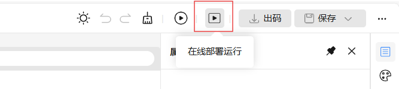
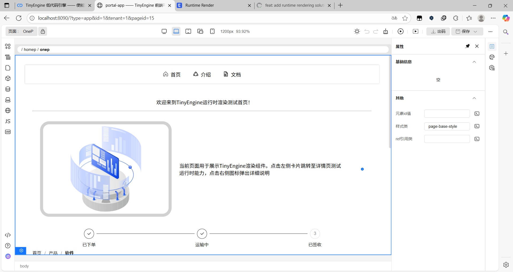
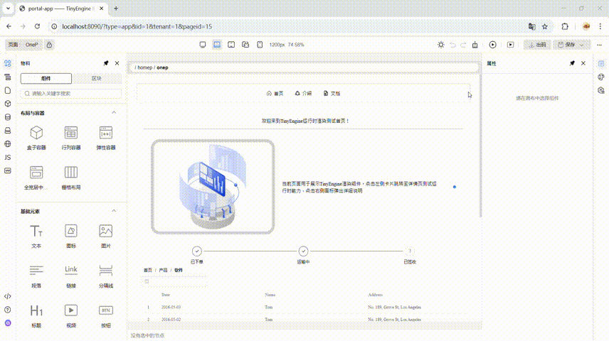

# 运行时渲染器使用说明

---

## 前言
运行时渲染器用于在浏览器中直接渲染低代码 Schema，提供与“出码”并行的即时运行路径，可在设计阶段获得接近真实的交互与数据效果。

## 快速开始

### 环境准备
- 确保已拉取包含 runtime-renderer 包的新版本代码。
- 在项目根目录执行：
  - `pnpm install` 安装依赖
  - `pnpm run dev` 启动项目
    或参考前后端联调[文档](https://opentiny.design/tiny-engine#/help-center/course/dev/debugging-of-java-backend)或[视频](https://www.bilibili.com/video/BV1TpZ5YqEKZ/?share_source=copy_web&vd_source=bed5a07195ea4a97bd9d6ccea9d8e3e3)来启动JAVA后端联调，获得更好的开发体验

### 启动运行时渲染器
- 在设计器界面，点击顶部工具栏的“运行时渲染”图标（见下图），系统会在新窗口中打开运行时页面。

- 默认行为：
  - 若当前正在编辑某页面，将自动路由至该页面；
  - 若当前未编辑页面（如正在编辑区块），将自动跳转到首页。
- 在项目启动的情况下，直接在浏览器中输入正确的url也可以访问应用页面，无需点击图标入口

### 运行效果说明
下图为同一页面在设计器与运行时渲染器中的对比效果：

- 设计器效果  


- 运行时渲染器效果


### URL 与路由说明

- 查询参数
  - id：应用标识
  - tenant：租户标识
  - platform：平台标识
- 哈希路由
  - 若当前正在编辑某页面，将自动路由至该页面，基于页面树中每个节点的 route 段，按祖先链拼接为 `#/<a>/<b>/<c>`。
  - 若当前未编辑页面（如正在编辑区块），默认跳转应用首页。

- 入口地址
  - 开发环境：`/runtime.html`
  - 生产环境：`/runtime`

- 访问示例
  - Dev: `http://localhost:8090/runtime.html?id=1&tenant=1&platform=1#/homep`
  - Prod: `https://your-host/runtime?id=1&tenant=1&platform=1#/home`

### 物料与依赖导入说明

当前运行时通过 bundle.json 读取物料包的 package 信息，支持从中读取用户添加的第三方物料依赖信息，无需额外手动导入。在资源管理中添加过cdn链接的npm包也无需额外引入。

如果第三方CDN包含子依赖，则需要手动在以下文件中补充 CDN 映射，支持完整cdn链接和包含占位符的格式：

- 文件路径：`packages/runtime-renderer/src/app-function/import-map.json`

示例：物料中使用 HUICharts 且其内部依赖 `echarts`，需为 `echarts` 在runtime-renderer 的 import-map.json 中添加映射：
```json
// filepath: packages/runtime-renderer/src/app-function/import-map.json
{
  "imports": {
    "echarts": "${VITE_CDN_DOMAIN}/echarts${versionDelimiter}5.4.1${fileDelimiter}/dist/echarts.esm.js"
  },
  "importStyles": {}
}
```