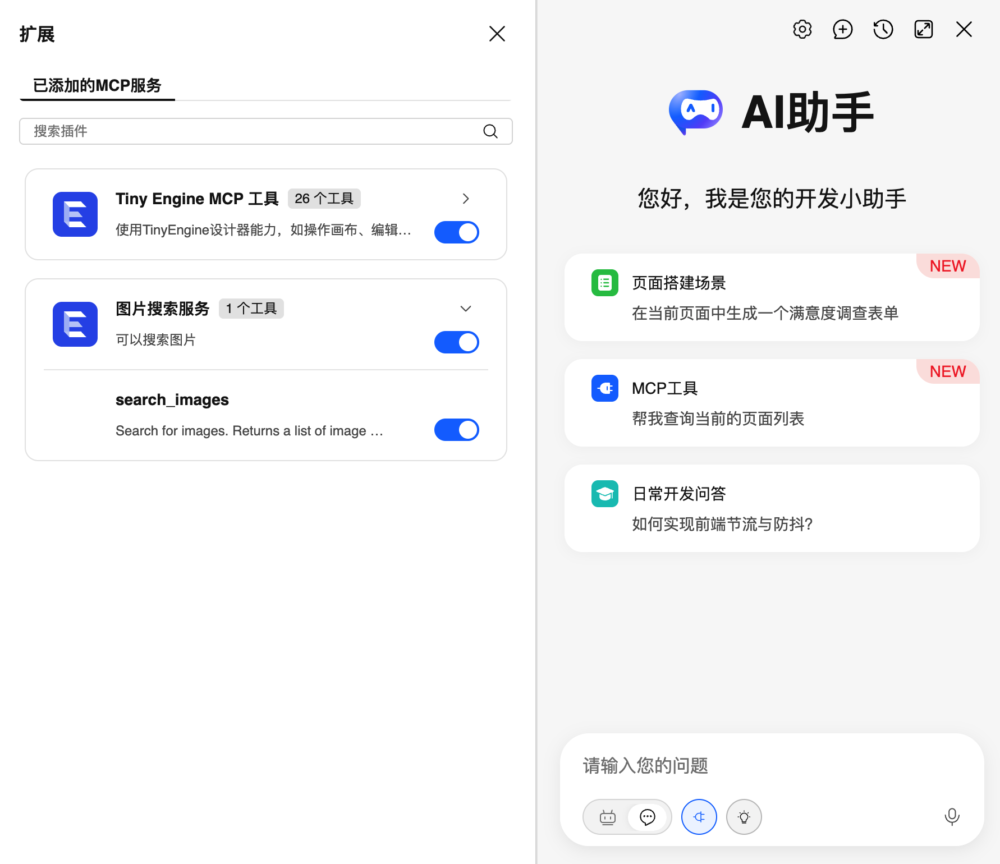
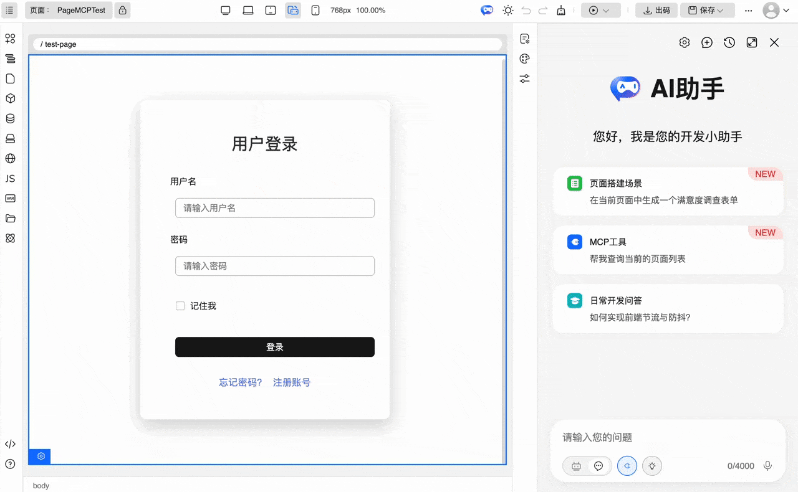

# TinyEngine2.10版本发布

## 前言

TinyEngine低代码引擎使开发者能够定制低代码平台。它是低代码平台的底座，提供可视化搭建页面等基础能力，既可以通过线上搭配组合，也可以通过cli创建个人工程进行二次开发，实时定制出自己的低代码平台。适用于多场景的低代码平台开发，如：资源编排、服务端渲染、模型驱动、移动端、大屏端、页面编排等。


近期，我们正式推出TinyEngine v2.10
版本，希望能够给大家带来更好的使用体验，能够深度定制化的同时可以更简洁便利地配置。

- 源码：https://github.com/opentiny/tiny-engine（欢迎 Star ⭐）

- 官网：https://opentiny.design/tiny-engine#/home

这次版本特性开发和问题修复已经有更多的开发者朋友参与进来，我们在此诚挚感谢 [@timtiam](https://github.com/timtian) [@0x7A7A6572](https://github.com/0x7A7A6572) [@QxQstar](https://github.com/QxQstar) [@LLDLLY](https://github.com/LLDLLY) 积极参加
TinyEngine 的开源共建，同时也邀请大家一起加入开源社区的建设，让
TinyEngine 成长的更加优秀和茁壮。

## v2.10.0 变更特性概览

- 【模型驱动】添加模型组件/模型管理插件/模型使用配置器  
    files: 
      - packages/plugins/model-manager
      - packages/builtinComponent/src/components/BaseForm.vue
      - packages/builtinComponent/src/components/BaseTable.vue
      - packages/builtinComponent/src/components/BasePage.vue
      - packages/configurator/src/model-configurator
      - packages/configurator/src/model-api-configurator
      - packages/configurator/src/model-common

- 【添加工作区】添加应用中心和模板中心   
    files: packages/workspace

-   注册登录
    files: packages/design-core/src/login

- 画布与Schema面板支持同步滚动  [#1714](https://github.com/opentiny/tiny-engine/pull/1714)

-   出码支持查看代码  [#1727](https://github.com/opentiny/tiny-engine/pull/1727)

-   协议css字段调整 [#1749](https://github.com/opentiny/tiny-engine/pull/1749)

-   增加图标类组件，图表组件属性设置优化（平铺展开） [#1750](https://github.com/opentiny/tiny-engine/pull/1750)

-   支持添加自定义 MCP 服务器 

- 【其他】功能细节优化&bug修复

## TinyEngine v2.10.0 新特性解读

### 1.【模型驱动】添加模型组件/模型管理插件/模型使用配置器

模型驱动特性是 TinyEngine v2.10 的核心功能之一，通过声明式的数据模型配置，自动生成对应的 UI 组件和数据交互逻辑。

#### 核心功能

- **模型管理器插件**：可视化的数据模型管理界面，支持模型的增删改查、字段配置和 API 配置
- **模型驱动组件**：提供 BaseForm（表单）、BaseTable（表格）、BasePage（完整页面）三个基础组件
- **模型配置器**：用于配置组件与模型的绑定、字段管理和 API 配置
- **零代码 CRUD**：无需编写代码即可实现完整的数据增删改查功能

#### 特性亮点

1. **开发效率提升 80%**：通过配置模型即可生成完整的 CRUD 页面
2. **支持多种字段类型**：String、Number、Boolean、Date、Enum、ModelRef
3. **嵌套模型支持**：支持字段关联其他模型，实现复杂数据结构
4. **灵活扩展**：可自定义字段类型和组件映射

#### 使用场景

- 后台管理系统的数据管理页面
- 需要频繁进行增删改查操作的业务场景
- 需要快速原型的项目

#### 快速开始

1. 打开模型管理器插件，创建数据模型
2. 配置模型字段和 API 方法
3. 拖入 BaseForm/BaseTable/BasePage 组件
4. 绑定模型，即可自动生成 UI

详细文档请参考：[模型驱动特性文档](./model.md)

 

### 2.【添加工作区】添加应用中心和模板中心

 

### 4. 注册登录

**一、界面操作**

1 登录界面：包含登录、注册、忘记密码、注册成功

2 用户配置插件

3 应用中心和模板中心的用户组织切换


**二、核心模块功能**

1 HTTP 拦截器模块

- 位置：packages/common/composable/http/index.ts

- 作用：拦截所有 API 请求，进行认证检查和 Token 管理

- 关键特性：

  1.  请求前检查登录状态

  2.  自动为认证请求添加 Authorization 头部

  3.  统一处理认证错误

  4.  支持请求取消机制

  5.  环境适配（开发/生产环境行为不同）

2 全局状态管理模块

- 位置：packages/common/composable/defaultGlobalService.ts

- 作用：管理用户登录状态、用户信息和租户上下文

- 关键 API：

  1.  getLoginStatus()：获取当前登录状态

  2.  setNeedToLogin()：设置登录需求状态

  3.  getUserInfo()/setUserInfo()：用户信息管理

  4.  fetchUserInfo()：从 API 获取用户信息

  5.  setTenantInfo()：设置租户上下文

3 登录组件模块

- 位置：packages/design-core/src/login/

- 组件结构：

  1.  Index.vue：登录页面容器

  2.  Login.vue：登录表单

  3.  Register.vue：注册表单

  4.  ForgotPassword.vue：密码找回

  5.  RegisterSuccess.vue：注册成功提示

  6.  useLogin.ts：共享状态和逻辑

4 用户工具栏模块

- 位置：packages/toolbars/user/

- 功能：显示用户信息、组织管理和退出登录

- 特性：

  1.  显示当前用户和头像

  2.  组织列表和切换功能

  3.  创建新组织

  4.  退出登录操作

**三、关键技术特性**

1 请求取消机制：使用 AbortController 实现请求取消，确保未登录状态下不会发出不必要的
API 请求。当检测到用户未登录时，自动取消所有非白名单请求.白名单接口（无需认证）：

```
// 登录相关接口
'platform-center/api/user/login'
'platform-center/api/user/register'
'platform-center/api/user/forgot-password'
'platform-center/api/user/me'
'platform-center/api/user/tenant'
// AI 相关接口
'app-center/api/chat/completions'
'app-center/api/ai/chat'
'app-center/api/ai/search'
```

2 密码验证策略：密码必须同时满足以下所有条件：

- 密码长度：8-20 个字符

- 必须包含大写字母（A-Z）

- 必须包含小写字母（a-z）

- 必须包含数字（0-9）

- 必须包含特殊字符：!@#\$%\^&\*()\_+-=[]{};\":\|,.'<\?。

- 不能有 3 个及以上连续相同字符

3 环境配置系统:

- 开发环境（MODE=dev）：

  1.  启动项目是通过 **pnpm dev:withAuth** 命令开启登录，**pnpm
      dev** 命令默认不开启

  2.  在 packages/design-core/registry.js 配置
```js
const isDevelopEnv = import.meta.env.MODE?.includes('dev')const useAuth = import.meta.env.VITE_AUTH === 'true'
// 通过设置enableLogin为true启动登录enableLogin: useAuth \|\| !isDevelopEnv
```
- 生产环境：启用完成登录认证

4 多租户支持：

- 用户可属于多个组织

- 动态切换组织上下文

- 组织间数据隔离

- URL 参数标识当前应用，当 URL 没有应用 id，会跳转到应用中心

### 5. 出码支持查看代码

出码功能新增源码预览能力，用户在导出代码前可以实时查看生成的源码内容，提升代码导出体验和准确性。


#### 功能特性

- **左右分栏布局**：左侧树形文件列表，右侧 Monaco 代码编辑器预览
- **智能初始化**：打开对话框时自动显示当前编辑页面对应的文件代码
- **实时预览**：点击树形列表中的任意文件，即可在右侧预览其代码内容
- **灵活选择**：支持勾选需要导出的文件，确认后选择保存目录即可


#### 使用方法

1 在编辑器中点击「出码」按钮，打开文件选择对话框

2 左侧树形列表显示所有可生成的文件，当前页面对应文件会自动展示在右侧编辑器中

3 点击树形列表中的任意文件，右侧编辑器会实时显示该文件的源码内容

4 勾选需要导出的文件，点击「确定」按钮，选择保存目录完成导出


 

### 6. 画布与Schema面板支持同步滚动

Schema面板新增"跟随画布"功能，启用后当在画布中选中组件时，Schema面板会自动滚动到对应位置并高亮显示。

#### 使用方法

1 打开Schema面板，勾选面板标题栏的"跟随画布"复选框

2 在画布中点击任意组件，Schema面板会自动滚动并高亮显示该组件对应的JSON定义

3 取消勾选"跟随画布"可关闭同步滚动功能

#### 特性优势

- 快速定位：当页面元素较多时，能快速找到对应组件的Schema配置
- 双向对照：可视化视图与JSON代码视图对照，便于理解页面结构
- 可控开关：用户可按需开启或关闭该功能

### 7. 协议css字段调整

页面Schema中的CSS样式字段由字符串格式优化为对象格式，提升样式配置的可读性和可维护性。

#### 功能特性

- **对象格式存储**：CSS以对象形式存储，更易于理解和编辑
- **自动兼容转换**：系统自动处理对象与字符串的相互转换
- **实时预览更新**：支持嵌套属性的深度监听，修改即时生效

#### 使用说明

该特性在底层自动处理，用户无需额外配置。在页面Schema中查看CSS时，将看到如下格式：

```javascript
css: {
  ".container": {
    "display": "flex",
    "justify-content": "center"
  },
  ".button": {
    "padding": "10px 20px",
    "background": "#007bff"
  }
}
```

出码时会自动转换为标准CSS字符串格式。

### 8. 增加图标类组件，图表组件属性设置优化（平铺展开）

图表组件的配置面板优化，将原有的整体options配置拆分为独立的属性配置项，使配置更加清晰直观。

#### 功能特性

- **属性平铺展开**：图表的各项配置（如颜色、数据、坐标轴、图例等）以独立属性呈现
- **新增配置器组件**：提供 `NestedPropertyConfigurator` 嵌套属性配置器
- **生命周期事件**：新增 `onReady` 和 `onReadyOnce` 事件，支持图表渲染后的回调

#### 使用说明

在页面中拖入图表组件后，在右侧属性面板中可以看到：

1. **颜色配置**：设置图表的颜色数组（JSON格式）
2. **数据配置**：绑定图表数据源
3. **系列配置**：配置系列属性
4. **坐标轴配置**：设置X轴和Y轴属性
5. **图例配置**：配置图例显示方式
6. **缩放配置**：设置数据缩放功能
7. **提示框配置**：配置鼠标悬停提示
8. **边距配置**：设置图表内边距
9. **主题配置**：选择或自定义主题

所有配置项平铺展示，点击对应项即可展开详细设置，无需编辑复杂的options对象。

#### 生命周期事件使用

在属性面板的「事件」分类中，可配置：
- `onReady`：图表首次渲染完成后触发
- `onReadyOnce`：图表首次渲染完成后触发一次

在事件回调中可访问图表实例进行自定义操作。

### 9. 支持添加自定义 MCP 服务器

之前版本中，TinyEngine已经提供内置MCP
服务，可以通过MCP工具让AI调用平台提供的各种能力。

本次特性是在TinyEngine 中支持添加自定义 MCP (Model Context Protocol)
服务器，可以通过配置轻松集成第三方 MCP 服务，扩展 AI
开发助手的工具能力。

 

#### 功能特性

- 灵活配置：通过注册表简单的配置即可添加自定义服务器

- 协议支持：支持 SSE 和 StreamableHttp 两种传输协议

- 服务管理：在 AI 插件的配置界面即可管理 MCP 服务器的开关状态

- 工具控制：可查看并切换各个工具的启用状态

 

#### 使用步骤

1 准备您的 MCP 服务器（需符合 [MCP
协议规范](https://modelcontextprotocol.io/)）

2 在项目的 `registry.js` 中添加配置

3 刷新编辑器，在 AI 插件 MCP 管理面板中即可看到新添加的服务器



4 启用服务器，选择需要的工具，即可在AI助手开始使用！

 

#### 场景示例

您可以通过该功能集成企业内部、社区MCP服务、第三方MCP工具
等MCP服务，以扩展 AI
助手的业务能力，下面是一个添加图片搜索MCP服务后使用AI生成带图片页面的场景示例：



###  

### 10. 【其他】功能细节优化&bug修复

- 区块管理/页面管理预览失败
   [@xuanlid](https://github.com/xuanlid)  [#1754](https://github.com/opentiny/tiny-engine/pull/1754)

- iframe嵌套设计器，打开设计器窗口的方式。[@xuanlid](https://github.com/xuanlid) 
   [#1753](https://github.com/opentiny/tiny-engine/pull/1753)

- 修复预览没有token的问题。 [@lichunn](https://github.com/lichunn)  [#1751](https://github.com/opentiny/tiny-engine/pull/1751)

- 插件栏资源管理/模型管理图标替换。[@xuanlid](https://github.com/xuanlid) 
   [#1740](https://github.com/opentiny/tiny-engine/pull/1740)

- 登录页最小高度适配。[@lichunn](https://github.com/lichunn)
   [#1742](https://github.com/opentiny/tiny-engine/pull/1742)

- 个人信息查询接口请求头去掉x-lowcode-org。[@xuanlid](https://github.com/xuanlid) 
   [#1739](https://github.com/opentiny/tiny-engine/pull/1739)

- 登录去掉调用设置租户接口。[@xuanlid](https://github.com/xuanlid) 
  [#1737](https://github.com/opentiny/tiny-engine/pull/1737)

- 创建应用添加framework字段。[@xuanlid](https://github.com/xuanlid) 
  [#1735](https://github.com/opentiny/tiny-engine/pull/1735)

- 应用中心添加选择组织/用户信息。[@xuanlid](https://github.com/xuanlid) 
  [#1734](https://github.com/opentiny/tiny-engine/pull/1734)

- 应用中心/模板中心交互优化，UI修改。[@xuanlid](https://github.com/xuanlid) 
  [#1733](https://github.com/opentiny/tiny-engine/pull/1733)

- 调整AI搭建功能请求逻辑和交互。[@lichunn](https://github.com/lichunn) 
  [#1658](https://github.com/opentiny/tiny-engine/pull/1658)

- 模型组件预览报错，找不到组件。[@betterdancing](https://github.com/betterdancing) 
  [#1646](https://github.com/opentiny/tiny-engine/pull/1646)

 

以上是此次更新问题修复的主要内容

如需了解更多可以查看：v2.10.0 所有 changelog (TODO: 添加链接)

 

## 结语

TinyEngine 2.10
版本更新不仅有全新的模型驱动、登录注册、代码补全、出码支持查看代码功能，还支持添加自定义
MCP 服务器 ，对图表组件属性设置等功能进行优化
。每一步前行都值得铭记，感谢有您陪伴我们一起迭代成长，同时也欢迎大家加入社区讨论，参与社区共建！
