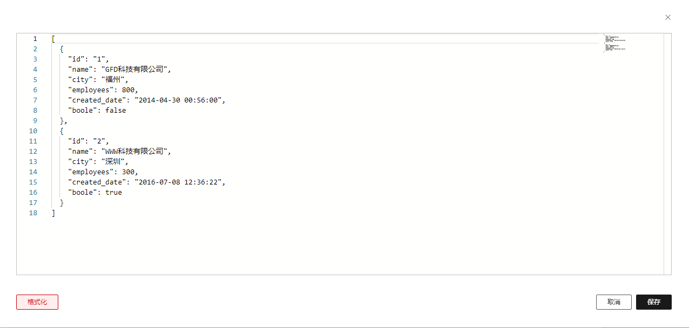

# CodeConfigurator

## 简介

代码设置器，是一个按钮，点击后会打开代码编辑器弹窗，用于编辑代码

## 展示




## 配置示例

```json
{
  "component": "CodeConfigurator",
  "props": {
    "language": "json"
  }
}
```

## Props说明

| Prop名称      | 类型                     | 默认值         | 说明               |
| ------------- | ------------------------ | -------------- | ------------------ |
| title         | `string \| object`       | `''`           | 代码编辑器弹窗标题 |
| language      | `'javascript' \| 'json'` | `'javascript'` | 代码编辑器语言     |
| dataType      |                          |                |                    |
| showFormatBtn | `boolean`                | `true`         | 是否显示格式化按钮 |
| showErrorMsg  | `boolean`                | `true`         | 是否显示错误信息   |
