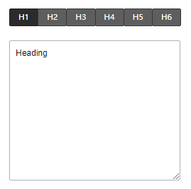

# HtmlTextConfigurator

## 简介

HTML元素文本设置器

## 展示



## 配置示例

```json
{
  "component": "HtmlTextConfigurator",
  "props": {
    "showRadioButton": true
  }
}
```

## Props说明

| Prop名称        | 类型      | 默认值  | 说明                   |
| --------------- | --------- | ------- | ---------------------- |
| showRadioButton | `boolean` | `false` | 是否显示标题元素选择器 |
