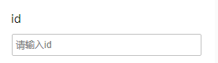

# InputConfigurator

## 简介

类型为输入框的设置器，用于输入文本

## 展示



## 配置示例

```json
{
  "component": "InputConfigurator",
  "props": {
    "type": "text",
    "placeholder": "请输入id"
  }
}
```

## Props说明

| Prop名称    | 类型                   | 默认值   | 说明                                                                        |
| ----------- | ---------------------- | -------- | --------------------------------------------------------------------------- |
| type        | `"text" \| "textarea"` | `"text"` | 输入框类型                                                                  |
| placeholder | `string`               | --       | 输入框占位文本                                                              |
| dataType    | `"Array"`              | --       | 当值为`"Array"`时，会将输入框的值使用英文逗号分割，然后将属性的值设置成数组 |
| rows        | `number`               | --       | 输入框行数，只对 `type="textarea"` 有效                                     |
