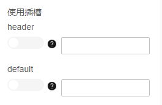

# JsSlotConfigurator

## 简介

插槽设置器，可以控制使用哪些插槽以及给插槽传递参数

## 展示



## 配置示例

```json
{
  "component": "JsSlotConfigurator",
  "props": {
    "slots": ["header", "default"]
  }
}
```

## Props说明

| Prop名称 | 类型            | 默认值 | 说明     |
| -------- | --------------- | ------ | -------- |
| slots    | `Array<string>` | `[]`   | 插槽名称数组 |
