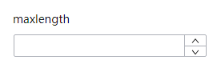

# NumberConfigurator

## 简介

数字设置器，可用于输入数字，可自定义数值范围与步进大小，并支持鼠标键盘增减

## 展示



## 配置示例

```json
{
  "component": "NumberConfigurator",
  "props": {
    "controls": true,
    "controlsPosition": "right",
    "max": 100,
    "min": 0
  }
}
```

## Props说明

| Prop名称         | 类型                                    | 默认值                                                      | 说明                                                       |
| ---------------- | --------------------------------------- | ----------------------------------------------------------- | ---------------------------------------------------------- |
| controls         | `boolean`                               | `true`                                                      | 是否使用加减按钮                                           |
| controlsPosition | `'right' \| ''`                         | `'right'`                                                   | 加减按钮位置，可选值为 right，表示加减按钮均位于最右侧     |
| max              | `number`                                | `Infinity`                                                  | 规定组件可输入的最大数值，指定合法值的范围，支持整数和小数 |
| min              | `number`                                | `-Infinity`                                                 | 规定组件可输入的最小数值，指定合法值的范围，支持整数和小数 |
| step             | `number`                                | `1`                                                         | 步长                                                       |
| showUnit         | `boolean`                               | `false`                                                     | 是否显示单位，如果为 true，组件值会包含单位                                               |
| units            | `Array<{value: string, label: string}>` | `[{ value: 'px', label: 'px' },{ value: '%', label: '%' }]` | 单位列表，可以通过选择器选择单位                           |
| selectedUnit     | `string`                                | `'px'`                                                      | 默认选中的单位                                             |
| unitSelectWidth  | `string`                                | `'25px'`                                                    | 单位选择器的宽度，默认 25px                                |
| allowEmpty       | `boolean`                               | `false`                                                     | 是否允许输入为空                                           |
| addonAfter       | `string`                                | `''`                                                        | 显示的单位，如果 `addonAfter` 有值，则不会显示单位选择器   |
