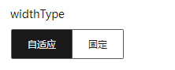

# RadioGroupConfigurator

## 简介

单选组设置器

## 展示



## 配置示例

```json
{
  "component": "RadioGroupConfigurator",
  "props": {
    "options": [
      { "label": "auto", "text": "自适应" },
      { "label": "fixed", "text": "固定" }
    ],
    "type": "button"
  }
}
```

## Props说明

| Prop名称 | 类型                                                                         | 默认值   | 说明           |
| -------- | ---------------------------------------------------------------------------- | -------- | -------------- |
| options  | `Array<string \| { label: string, text: string \| Record<string, string> }>` | `[]`     | 单选组设置列表 |
| type     | `'radio' \| 'button'`                                                        | `'radio` | 单选组展示形式 |
