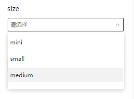

# SelectConfigurator

## 简介

类型为选择器的设置器，用于选择选项

## 展示



## 配置示例

```json
{
  "component": "SelectConfigurator",
  "props": {
    "options": [
      {
        "label": "mini",
        "value": "mini"
      },
      {
        "label": "small",
        "value": "small"
      },
      {
        "label": "medium",
        "value": "medium"
      }
    ]
  }
}
```

## Props说明

| Prop名称 | 类型                                                             | 默认值 | 说明                                                                                 |
| -------- | ---------------------------------------------------------------- | ------ | ------------------------------------------------------------------------------------ |
| options  | `Array<{ label: string, value: string }>`                        | --     | 可选项                                                                               |
| multi    | `boolean`                                                        | false  | 是否允许选择多个选项                                                                 |
| groups   | `Array<{ label: string, content: string[], disabled: boolean }>` | --     | 对可选项进行分组。`content`数组里面的项目为可选项的`value`，表示这些可选项属于这个组 |
