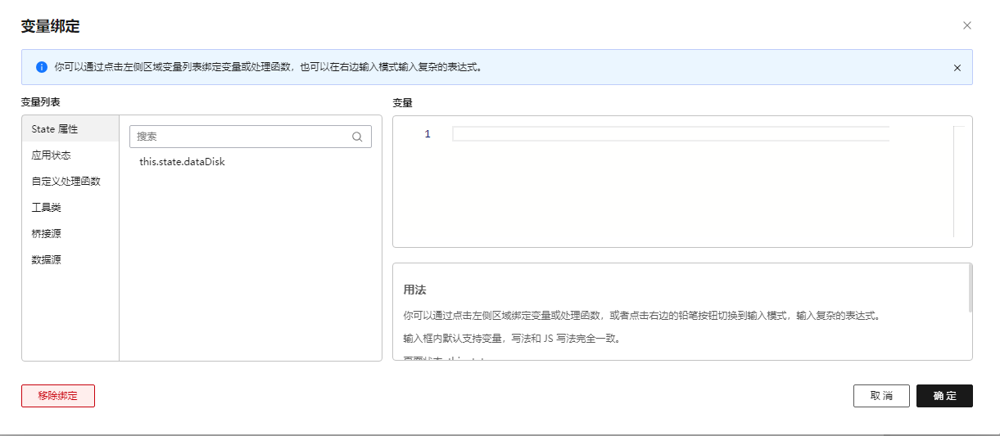

# VariableConfigurator

## 简介

变量绑定设置器，用于给属性绑定到变量

## 展示



## 配置示例

属性面板默认所有属性都会附加一个变量绑定设置器，以下几种情况除外：

1. 非第一级属性面板
2. 只读
3. 属性设置器为 `RelatedEditorConfigurator` 或 `RelatedColumnsConfigurator`

如果不需要绑定变量入口，可以将物料中不需要绑定变量的属性的 `bindState` 字段设置为 `false`

```json
{
  "property": "tabs",
  "label": {
    "text": {
      "zh_CN": "选项卡"
    }
  },
  "bindState": false
}

```
