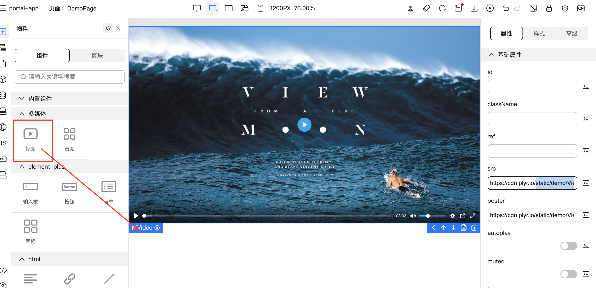
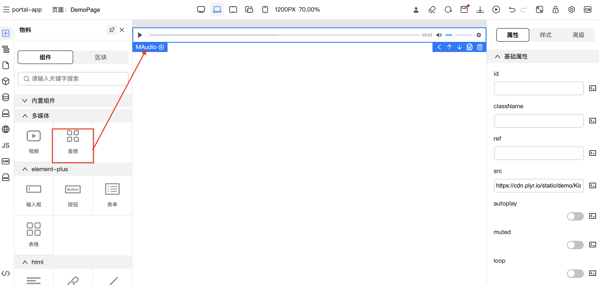
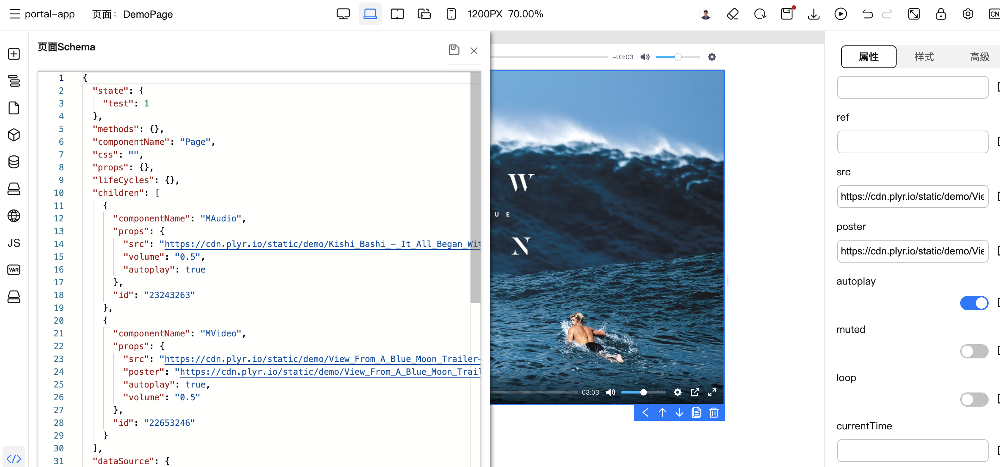

# 基于Plyr的多媒体物料库

此物料库包含物料库描述文件和物料组件代码

## 使用案例
视频物料案例


音频物料案例


生成的Scheme案例


## 使用指南
### dev
```bash
npm run docs:dev # 开发环境
```
执行上面命令可进入到组件的开发环境，包括组件的文档。

### 组件库文档
```bash
npm run docs:build
```
执行上面命令，可构建出组件库文档。

### dev
```bash
npm run dev # 开发环境调试物料
```

### build
```bash
npm run build # 生产环境
```
执行上面命令后，会在dist文件夹中生成组件的es库(index.es-browser.js)和物料描述（bundle.json）

### 应用到TinyEngine上

可以将dist部署到静态服务器中，然后修改lowcode.config.js中物料请求地址

ps: 注意修改bundle.json中组件的npm中script和css的地址。

## 作品概述

### 项目背景
在TinyEngine上开发项目时，可能有些组件库并不能满足所需场景，还需要搭建自己的组件库或者高阶组件，然后在发布到TinyEngine中使用，在此以音视频为例，搭建了一套自定义组件物料的模板，可以快速的帮助我们搭建符合需求的物料库。

### 应用领域
Web多媒体

### 设计思路
1. 使用VitePress搭建组件开发模板，可以在开发中预览组件和生成组件文档。
2. 使用TinyEngine物料协议生成物料描述文件bundle.json
3. 将组件库打包成es模块文件，让TinyEngine可以加载组件库。

### 功能特点
- 开发时可预览组件
- 有组件文档
- bundle.json文件更好维护

### 体系架构
- vue
- vitepress
- plyr

### 关键性技术