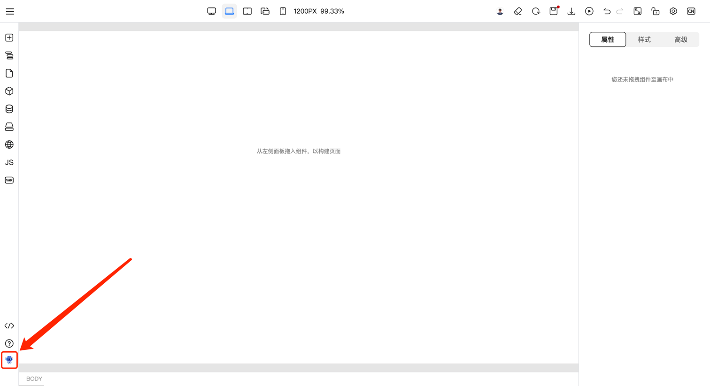
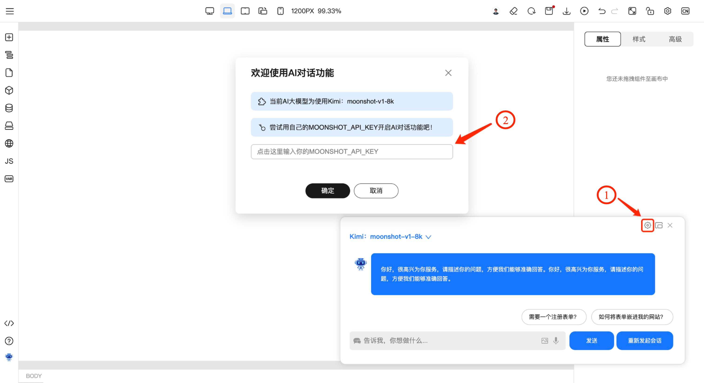
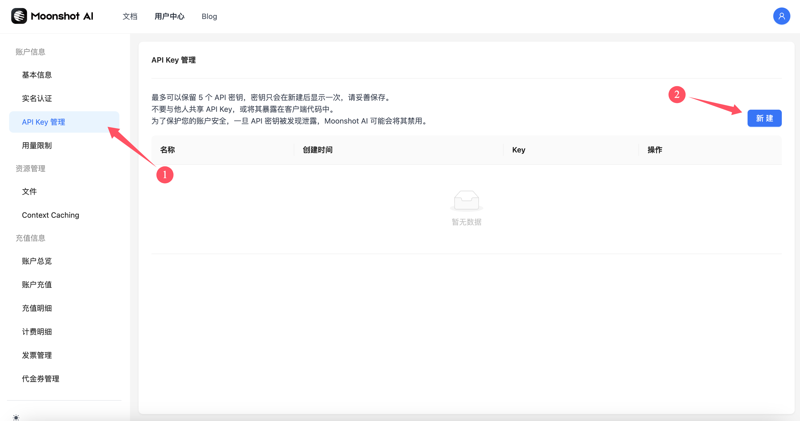
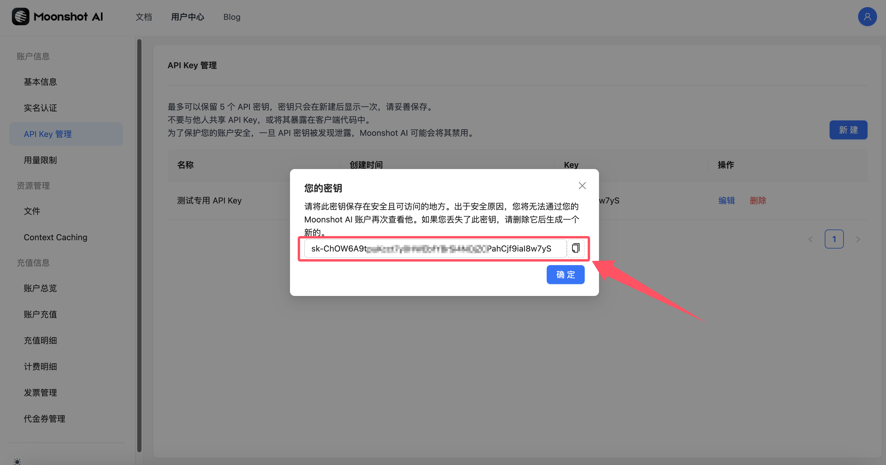
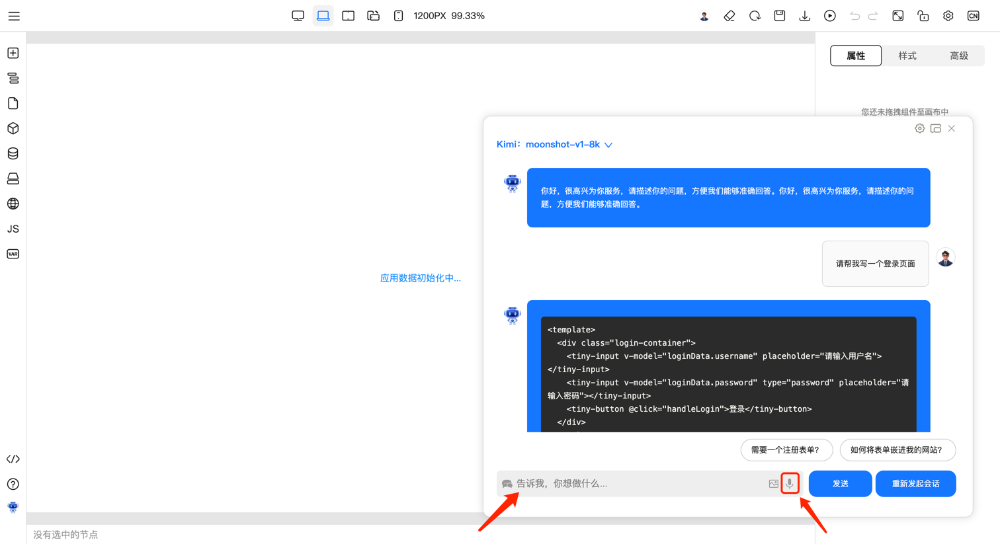

# 打开 AI 聊天窗口

# 配置 AI 访问令牌

为了确保您的会话安全且有效，您需要输入属于您个人的 AI 访问令牌。请按照以下步骤操作：

1. 在聊天窗口中找到令牌输入区域。
2. 输入您从对应 AI 模型官网获取的访问令牌。
3. 确保令牌的准确性，以避免连接错误。

**如何获取 Kimi 接口访问令牌？**

- 访问令牌需要您自行前往 [Moonshot AI 开放平台](https://platform.moonshot.cn/console/api-keys) 生成并保存。
  - 在左侧菜单选择 “ API Key 管理 ”，根据指引创建个人密钥。
    

  - 注意密钥只会在新建后显示一次，妥善保存您所生成的密钥。如果您遗失了令牌，请登录到您的 API Key 管理页面重新生成新的令牌。
    

# 通过提问，让AI生成页面

您可以上传图片，并通过语音或手动输入需求描述生成代码。AI 生成的代码将自动渲染在画布上，实时显示页面效果。

# 通过继续提问，让AI修改生成的页面

如需对生成的页面进行调整，只需继续提问。AI 将根据您的新指令对页面进行迭代修改，帮助您逐步完善设计与功能。