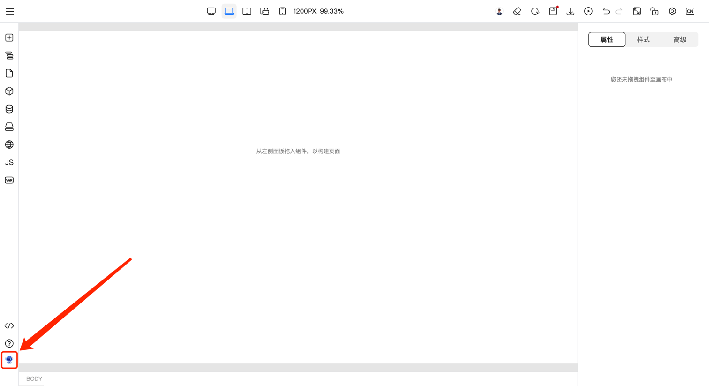
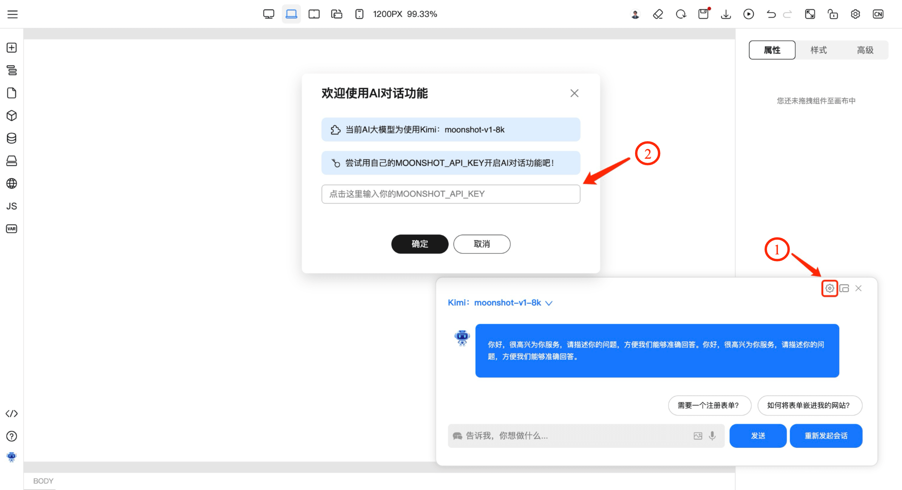
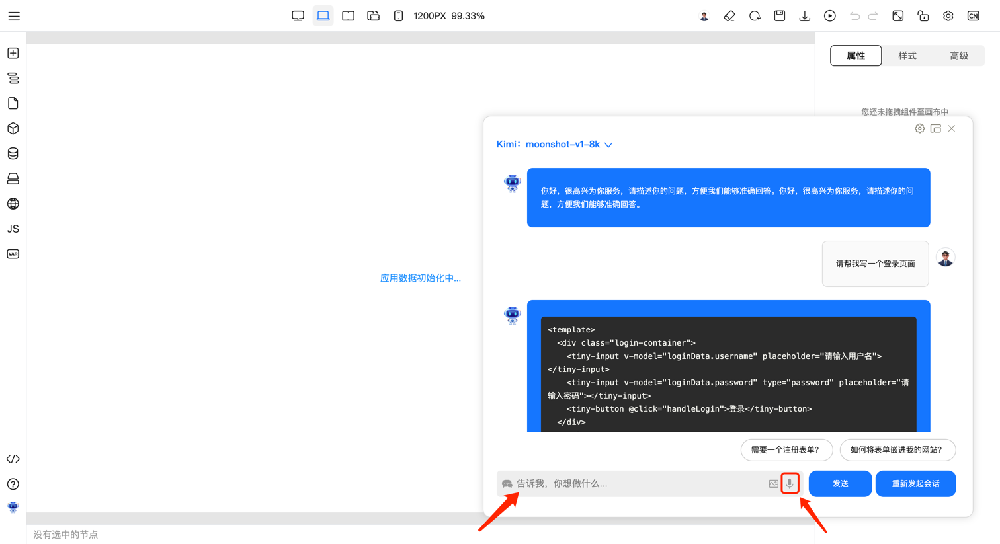

# 打开 AI 聊天窗口

# 配置 AI 访问令牌

为了确保您的会话安全且有效，您需要输入属于您个人的 AI 访问令牌。请按照以下步骤操作：

1. 在聊天窗口中找到令牌输入区域。
2. 输入您从对应 AI 模型官网获取的访问令牌。
3. 确保令牌的准确性，以避免连接错误。

**如何获取 Kimi 接口访问令牌？**

- 访问令牌通常在您注册或申请接入 Kimi 接口时由我们的系统生成。
- 如果您遗失了令牌，或者需要重新生成新的令牌，请登录到您的账户管理页面，或者联系我们的客服团队获取帮助。

# 通过提问，让AI生成页面

可以依照指令或者上传的图片生成代码，在这里AI生成的代码会直接渲染在画布中。

# 通过继续提问，让AI修改生成的页面

如果您需要对 AI 生成的页面进行调整，只需继续提问，AI 将根据您的新指令对页面进行修改。这一迭代过程将帮助您实现更精确的页面设计和功能完善。

